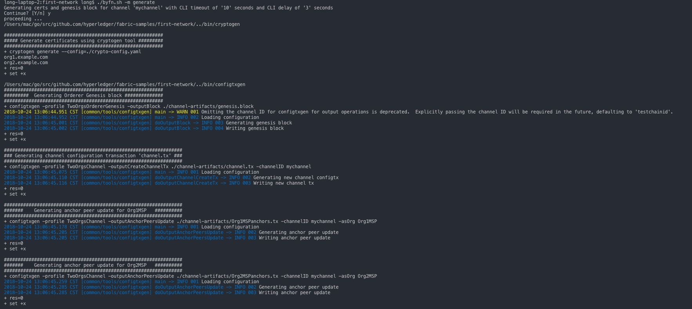
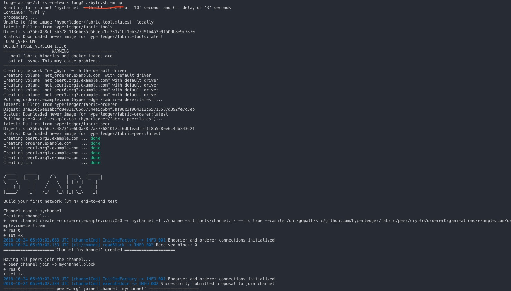
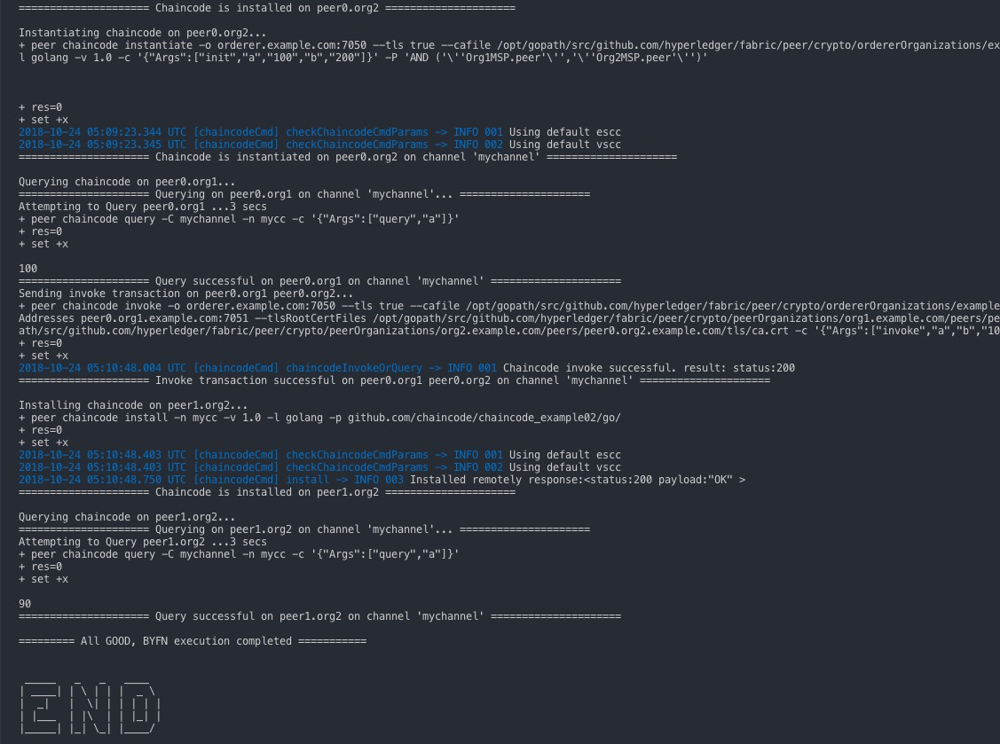

# Fabric网络构建方法 - 已经全部验证，后续只需要按下面步骤傻瓜式敲入命令

```
  官方例子：
  https://github.com/hyperledger/fabric  
  https://github.com/hyperledger/fabric-samples  
```  

初始目的 ：

利用这些Docker镜像可以快速引导一个由4个代表2个不同组织的peer节点以及一个排序服务节点的Hyperledger fabric网络。  
它还将启动一个容器来运行一个将peer节点加入channel、部署实例化链码服务以及驱动已经部署的链码执行交易的脚本。按照我验证的方式，傻瓜式操作即可。  
这里暂时跳过docker 、docker-compose 、 golang 这些环境的配置。大致步骤如下：

A. 构建第一个fabric 网络

- 在golang运行环境的src目录下，创建src/github.com/hyperledger/，最终目录为

```
~/go/src/github.com/hyperledger/
```

- clone 代码库: 切换到~/go/src/github.com/hyperledger/目录下，使用如下命令克隆fabric-sample仓库。

```
git clone https://github.com/hyperledger/fabric-samples.git
```

- 安装fabric命令、下载docker镜像

```
curl -sSL https://raw.githubusercontent.com/hyperledger/fabric/master/scripts/bootstrap.sh | bash
```

该命令执行完成后，当前目录下会出现 bin 目录，里面都是 fabric 的一些命令。另外使用 docker images 可以看到下载了很多镜像，这些镜像都是启动 fabric 要使用的。

> 生成配置文件:   
切换到 first-network 目录，然后执行 ./byfn.sh -m generate, 相关的配置文件会在 crypto-config 目录中生成。如图：  

  

> 启动网络:  
运行 ./byfn.sh -m up。看到类似如下内容，说明成功。

  

  

这样就把一个 fabric 的网络搭建起来了。

> 停止网络:  
运行 ./byfn.sh -m down  

>> 大致执行的内容：（摘抄自官网，但是整个区块链网络执行中涉及全部流程）
```
1.script.sh脚本被拷贝到CLI容器中。这个脚本驱动了使用提供的channel name以及信道配置的channel.tx文件的createChannel命令。

2.createChannel命令的产出是一个创世区块-<your_channel_name>.block-这个创世区块被存储在peer节点的文件系统中同时包含了在channel.tx的信道配置。

3.joinChannel命令被4个peer节点执行，作为之前产生的genesis block的输入。这个命令介绍了peer节点加入<your_channel_name>以及利用<your_channel_name>.block去创建一条链。

4.现在我们有了由4个peer节点以及2个组织构成的信道。这是我们的TwoOrgsChannel配置文件。
peer0.org1.example.com和peer1.org1.example.com属于Org1;peer0.org2.example.com和peer1.org2.example.com属于Org2。这些关系是通过crypto-config.yaml定义的，MSP路径在docker-compose文件中被指定。

5.Org1MSP(peer0.org1.example.com)和Org2MSP(peer0.org2.example.com)的anchor peers将在后续被更新。我们通过携带channel的名字传递Org1MSPanchors.tx和Org2MSPanchors.tx配置到排序服务来实现anchor peer的更新。

6.一个链码-chaincode_example02被安装在peer0.org1.example.com和peer0.org2.example.com
这个链码在peer0.org2.example.com被实例化。实例化过程将链码添加到信道上，并启动peer节点对应的容器，并且初始化和链码服务有关的键值对。示例的初始化的值是[”a“,”100“，”b“，”200“]。实例化的结果是一个名为dev-peer0.org2.example.com-mycc-1.0的容器启动了。

7.实例化过程同样为背书策略传递相关参数。策略被定义为-P "OR ('Org1MSP.member','Org2MSP.member')"，意思是任何交易必须被Org1或者Org2背书。

8.一个针对a的查询发往peer0.org1.example.com。链码服务已经被安装在了peer0.org1.example.com，因此这次查询将启动一个名为dev-peer0.org1.example.com-mycc-1.0的容器。查询的结果也将被返回。没有写操作出现，因此查询的结果的值将为100。

9.一次invoke被发往peer0.org1.example.com，从a转移10到b。然后链码服务被安装到peer1.org2.example.com

10.一个query请求被发往peer1.org2.example.com用于查询a的值。这将启动第三个链码服务名为dev-peer1.org2.example.com-mycc-1.0。返回a的值为90,正确地反映了之前的交易，a的值被转移了10。

