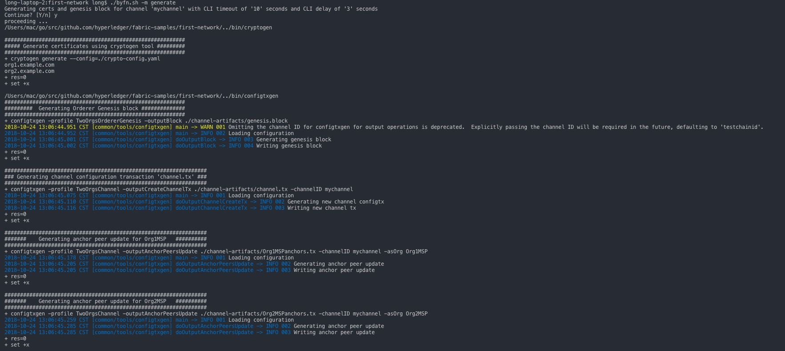
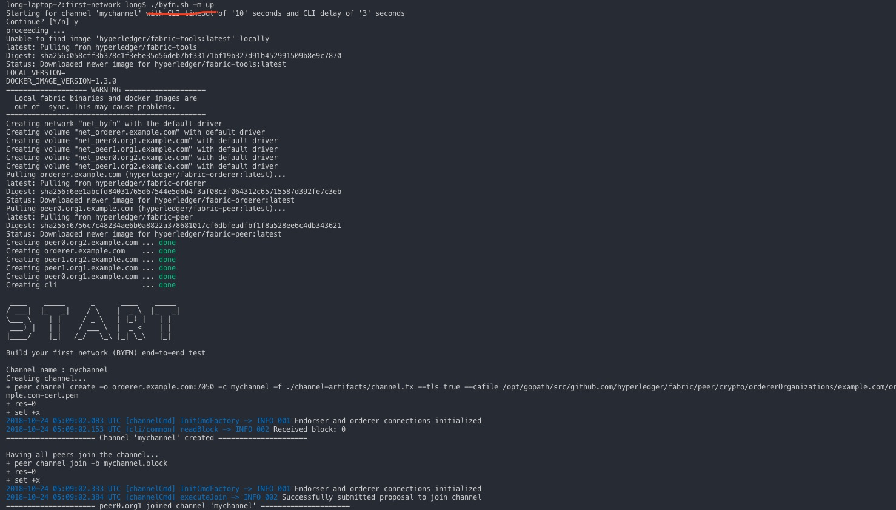
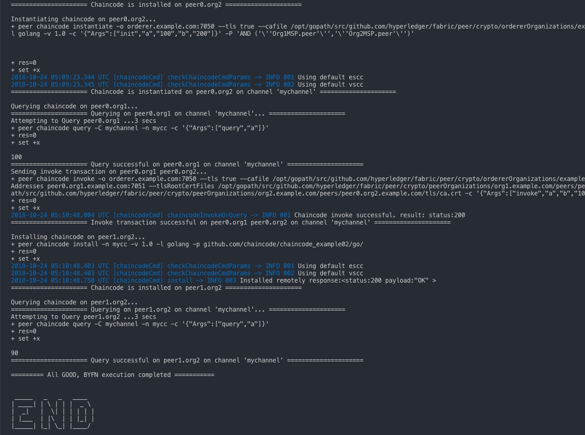

# Hyperledger相关整理文档  

随着该技术发展成熟，早期阶段学习该技术的投资将会不断得到丰厚的回报。  

1.初期技术要求：  
  
  可以配合使用一些插件，方便整个代码查看和Docker 镜像的管理 。  

  golang\Java\Docker\NodeJS\移动端 , 以上前三种是能处理hyperledger前提 。  

  其中chaincode 只能用go 和java 进行开发。  
  
  Docker 用于部署镜像使用。  
  
  注：一定要看白皮书，是后续的总纲 ； 后续可使用k8s。  
  ```
  a. 代码查看-chrome插件 ：  
  https://about.sourcegraph.com/  

  b. Portainer - docker 插件 ：查看CLI 和管理镜像  
  https://portainer.readthedocs.io/en/stable/  
  ```
  
2.相关能用：  

```  
百度网盘资源：（粗略过一遍即可 - 配合白皮书了解大概）  
链接:https://pan.baidu.com/s/1fiEtMnY_hgrQF9sRnKsXtw  密码:9z6i

中文文档：  
https://hyperledgercn.github.io/hyperledgerDocs/ (重点必看！！！)

大致了解其中词汇 ：  
https://hyperledgercn.github.io/hyperledgerDocs/glossary/  

Demo例子：  
https://anders.com/blockchain/coinbase.html  
https://blockchaindemo.io/  
```

3.Hyperledger网络和Fabric相关部署方法：（已经验证）

```
  官方例子：
  https://github.com/hyperledger/fabric  
  https://github.com/hyperledger/fabric-samples  
```  

初始目的 ：

利用这些Docker镜像可以快速引导一个由4个代表2个不同组织的peer节点以及一个排序服务节点的Hyperledger fabric网络。  
它还将启动一个容器来运行一个将peer节点加入channel、部署实例化链码服务以及驱动已经部署的链码执行交易的脚本。按照我验证的方式，傻瓜式操作即可。  
这里暂时跳过docker 、docker-compose 、 golang 这些环境的配置。大致步骤如下：

A. 构建第一个fabric 网络

- 在golang运行环境的src目录下，创建src/github.com/hyperledger/，最终目录为

```
~/go/src/github.com/hyperledger/
```

- clone 代码库: 切换到~/go/src/github.com/hyperledger/目录下，使用如下命令克隆fabric-sample仓库。

```
git clone https://github.com/hyperledger/fabric-samples.git
```

- 安装fabric命令、下载docker镜像

```
curl -sSL https://raw.githubusercontent.com/hyperledger/fabric/master/scripts/bootstrap.sh | bash -s 1.3.0
```

该命令执行完成后，当前目录下会出现 bin 目录，里面都是 fabric 的一些命令。另外使用 docker images 可以看到下载了很多镜像，这些镜像都是启动 fabric 要使用的。

> 生成配置文件:   
切换到 first-network 目录，然后执行 ./byfn.sh -m generate, 相关的配置文件会在 crypto-config 目录中生成。如图：  

  

> 启动网络:  
运行 ./byfn.sh -m up。看到类似如下内容，说明成功。

  

  

这样就把一个 fabric 的网络搭建起来了。

> 停止网络:  
运行 ./byfn.sh -m down  

4.ChainCode 典例源码：（必须要看，参考书写格式、理解大致使用业务场景）  

5.本地如何调试ChainCode  

6.ChainCode 用Go 和 Java语言的比较（建议使用Golang）  